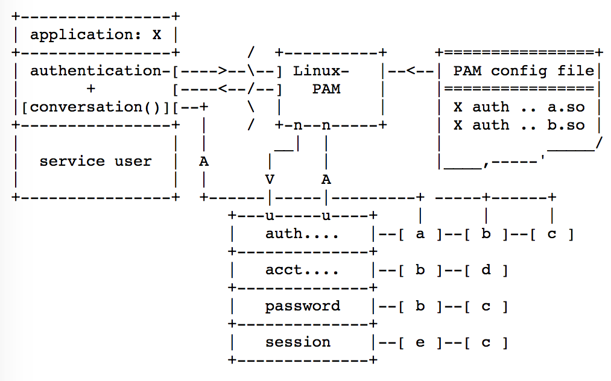

#Linux PAM介绍
## 特点
  - 服务程序和认证机制的分离
  - 采用模块化设计和插件功能
## 职责
  - authentication management
  - account management
  - session management
  - password management.

## 架构

- 参考
  - [PAM的原理与应用](https://blog.csdn.net/shenlan211314/article/details/6569592)
  - [深入 Linux PAM 体系结构](https://www.ibm.com/developerworks/cn/linux/l-cn-pam/index.html)
  - [Linux pam](http://www.linux-pam.org/)
