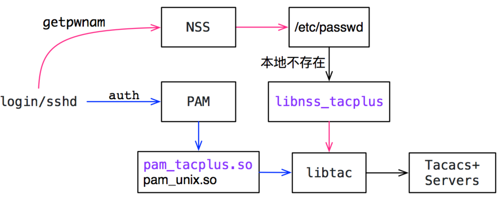
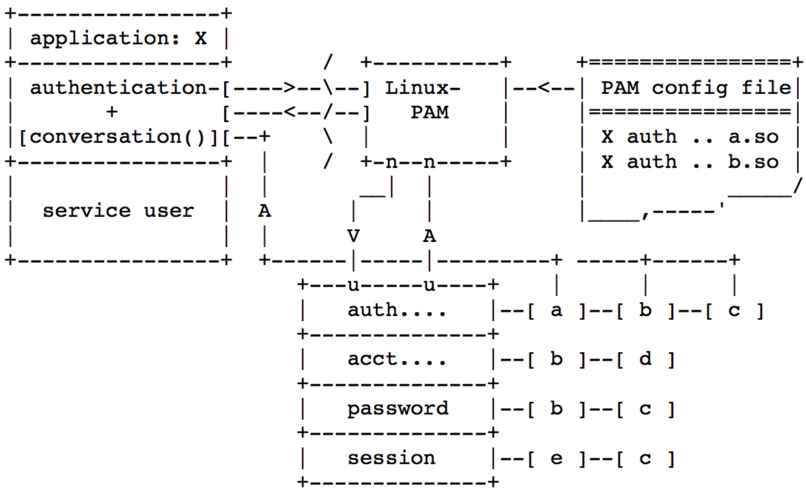

# 基于tacplus的认证实现

## 原理



- libnss_tacplus
  - 实现getpwnam调用的NSS功能，优先从本地/etc/passwd读取。
  - 如果本地不存在，则通过该模块从tacacs+服务器上获取用户信息，并通过useradd添加该用户
- libpam_tacplus 负责基于tacplu的认证功能

## 认证流程

- telnet对应login服务，ssh对应sshd服务
- 调用getpwnam获取用户信息（[NSS](https://www.gnu.org/software/libc/manual/html_node/Name-Service-Switch.html#Name-Service-Switch)模块控制）
  - 优先从本地/etc/passwd读取，如果存在则返回
  - 否则，通过libnss_tacplus，从tacacs+服务器获取用户信息
    - 获取成功，通过useradd添加该用户
- [PAM](http://www.linux-pam.org/Linux-PAM-html/sag-overview.html)模块进行认证处理
  - 

## 安装组件

```
dpkg -i libtac2_1.4.1-1_amd64.deb
dpkg -i libnss-tacplus_1.0.4-1_amd64.deb
dpkg -i libpam-tacplus_1.4.1-1_amd64.deb
```

## 配置示例

```s
# show aaa
AAA authentication login tacacs+,local
AAA authentication failthrough True (default)
AAA authentication fallback True (default)

# show tacacs
TACPLUS global auth_type login
TACPLUS global timeout 5 (default)
TACPLUS global passkey testing123

TACPLUS_SERVER address 172.18.9.106
                priority 1
                tcp_port 49
                auth_type login
                passkey testing123
```

- login 优先tacacs+认证，失败后用本地passwd认证
- failthrough 失败后，是否继续后面其他方式认证
- fallback

## 配置文件

```t
# /etc/nsswitch.conf
passwd:         compat tacplus

#/etc/tacplus_nss.conf
server=172.18.9.106:49,secret=testing123,timeout=5

# /etc/pam.d/common-auth
auth	[success=done new_authtok_reqd=done default=ignore]	pam_tacplus.so server=172.18.9.106:49 secret=testing123 login=login timeout=5 try_first_pass
```

## 日志

```
/var/log/auth.log
```

可通vim修改配置文件，添加nss_tacplus和pam_tacplus的debug信息输出，如下

```sh
# /etc/tacplus_nss.conf添加如下内容
debug=on

# /etc/pam.d/common-auth auth条目添加debug
auth	[success=done new_authtok_reqd=done default=ignore]	pam_tacplus.so server=172.18.9.106:49 secret=testing123 login=login timeout=5 debug try_first_pass
```
