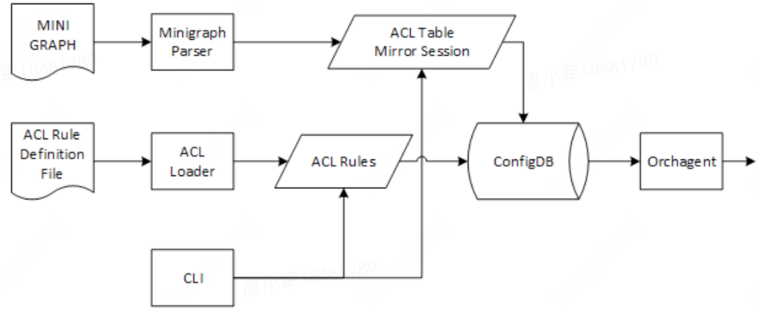
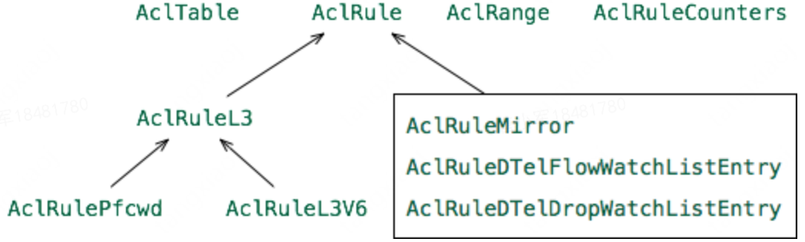

# ACL模块实现

## ACL配置

配置流程如图，详细过程参考：ACL Configuration High Level Design



CONF_DB配置示例

```
"ACL_TABLE": {
    "data-aclv4": {
        "policy_desc": "data-aclv4",
        "ports": [
            "Ethernet0"
        ],
        "type": "L3"
        "stage": "INGRESS"
    }
},
"ACL_RULE": {
    "data-aclv4|ICMP": {
        "SRC_IP" : "10.0.0.1/24",
        "DST_IP" : "10.0.0.3/24",
        "PACKET_ACTION": "FORWARD",
        "PRIORITY": "2000"
    },
    "data-aclv4|L2": {
        "ETHER_TYPE": "0x8100",
        "PACKET_ACTION": "FORWARD",
        "PRIORITY": "3000"
    }
}
```

说明：基本具体配置项见aclorch.h。其中，

- stage可选项：INGRESS、EGRESS
- 表类型可选项：L3、L3V6、MIRROR、PFCWD、CTRLPLANE、DTEL_FLOW_WATCHLIST、DTEL_DROP_WATCHLIST

为不同用途的ACL，配置特定的表属性和规则属性选项。

- PACKET_ACTION可配置项
  - FORWARD 转发
  - DROP 丢弃
  - REDIRECT:<ip_addr1>,<ip_addr2>,<ip_addr3> 重定向
    - 当REDIRECT有多个ip时，添加并设置NextHopGroup，支持ECMP

## AclOrch实现

SONiC ACL由AclOrch模块实现，主要类如下：



主要处理流程

- 以SubscriberStateTable方式订阅：CFG_ACL_TABLE_NAME、CFG_ACL_RULE_TABLE_NAME、STATE_LAG_TABLE_NAME
- AclTable创建处理
  - 如果表已存在，调用sai接口删除改ACL关联的SAI实体
  - 根据不同类型设置表属性，并sai_acl_api->create_acl_table
  - gPortsOrch->bindAclTable
    - 创建group：sai_acl_api->create_acl_table_group
    - 设置port的acl group属性： SAI_x_ATTR_INGRESS_ACL/SAI_x_ATTR_EGRESS_ACL
    - 创建acl group member：sai_acl_api->create_acl_table_group_member
- AclRule创建处理
  - 创建Ruel实例：AclRule::makeShared
  - 验证设置属性
    - validateAddPriority
    - validateAddMatch
    - validateAddAction
      - 对于L3 ACL，通过m_pAclOrch->m_neighOrch->getNextHopId(ip)获取下一跳
  - AclTable::add(shared_ptr<AclRule> newRule)
    - 移除已有rule
    - 如有range属性，创建range对象
  - 创建rule：sai_acl_api->create_acl_entry