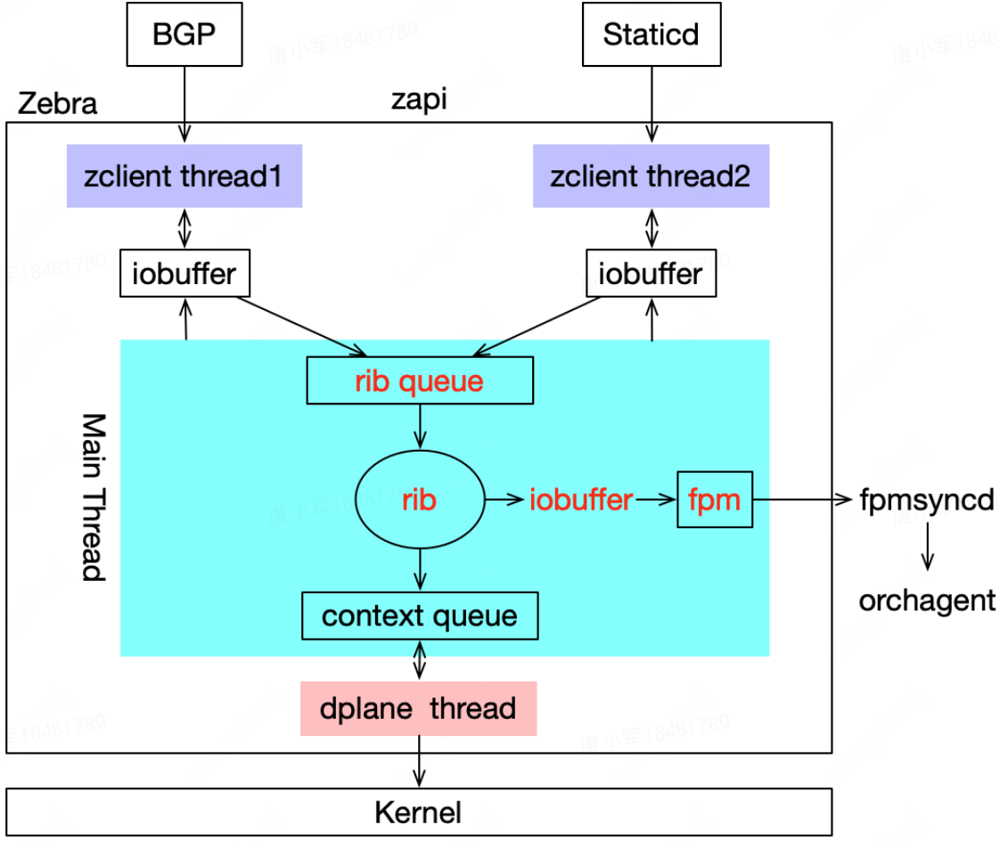
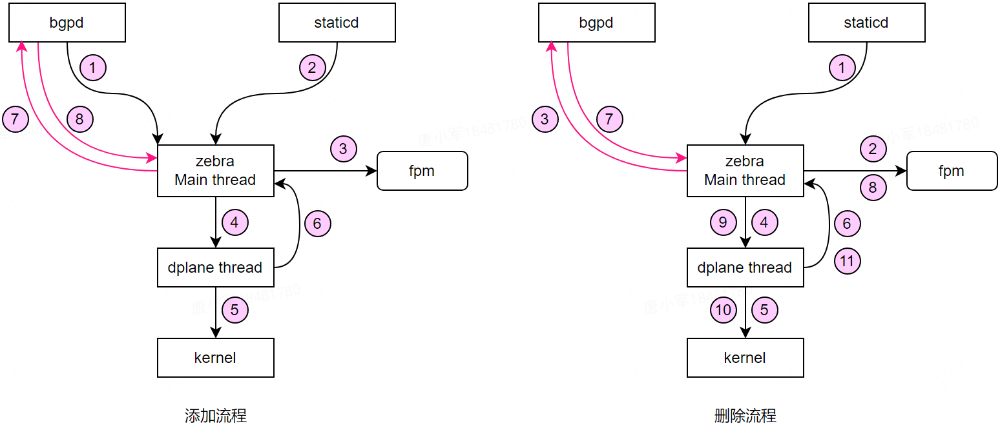

# 静态路由处理流程

## Zebra实现

并发特点

- 多线程：主线程、dplane线程、client线程
- 每个线程实现基于poll的"事件"驱动

## 静态路由处理流程

### 添加流程

- 假设bgpd已将从多个leaf学习到(另一个tor发送的)nd2host的ecmp路由下发给zebra，此时rib中的selected路由为bgp的ecmp路由
- arp2host通过vty向staticd添加静态路由，staticd处理后向zebra发送路由添加消息
- 此时zebra同时存在ecmp和静态路由，经rib选路后selected路由为静态路由，并通知fpm，updating existing route
- 将selected路由添加到上下文队列，并通知dplane线程处理
- dplane线程更新kernel路由
- 更新kernel路由后，并执行zebra主线程注册的上下文回调
- 回调函数中，重分发静态路由给bgpd
- bgpd进行本地ecmp路由和静态路由选路，静态路由更优，并向zebra发送ecmp路由删除。此时rib只存在静态路由条目

### 删除流程

- arp2host通过vty向statid删除静态路由，staticd处理后向zebra发送路由删除消息
- zebra的rib将静态路由条目标志位移除状态，并通知fpm，删除该静态路由
- rib处理流程中向bgpd重分发静态路由删除消息
- 该静态路由添加到上下文队列，并通知dplane线程处理
- dplane线程删除kernel中的路由
- 更新kernel路由后，执行zebra主线程注册的上下文回调，彻底删改路由条目。此时rib已不存在该nd2host路由条目(静态和bgp ecmp)
- bgpd删除静态路由后，重新选路；选中ecmp路由，并向zebra发送路由添加消
- zebra收到bgp ecmp路由后，rib选路后；选中ecmp路由，并通知fpm，添加该ecmp路由
- 将selected路由(ecmp)添加到上下文队列，并通知dplane线程处理
- dplane线程向kernel添加路由
- 更新kernel路由后，并执行zebra主线程注册的上下文回调