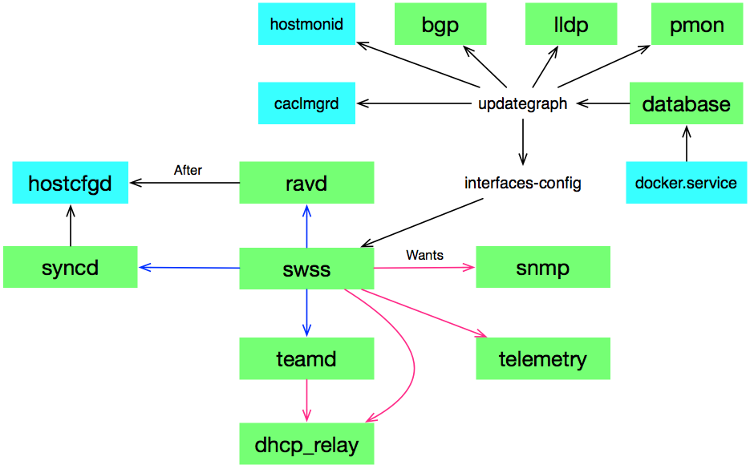

# Host服务启动流程
  sonic的服务管理可分为两类：host服务和容器服务，其中host服务基于system方式管理，
而容器服务基于supervisor管理。下图仅给出主要host服务的启动流程

其中：

- 黑箭头  表示before/after关系：before -> after
- 红箭头 表示wants关系
- 蓝箭头 表示脚本启动，即swss通过服务脚本启动了ravd、teamd和syncd服务,见files/scripts/swss.sh

## service的关键配置项

- [Unit]
  - Requires  配置启动该服务时要求启动的服务
    - 如果没有启动，启动该服务时会自动启动这些服务
    - 如果这些服务未能成功启动，该服务不会启动
  - After和Before 表示该服务在这些服务的后面还是前面启动
    - 这两个选项仅用于控制的启动顺序，而不是依赖关系。也就是说当这些服务都需要启动时，才有顺序控制

- [Service]
  - Type=oneshot 用于表示一次性的服务，默认情况下为该值
  - RemainAfterExit=yes 对于一次性服务特别有用，当其退出后，仍将其服务设置为active状态

- [Install]
  - WantedBy 将该服务添加到指定服务组
    - 当服务组的服务启动时，如果该服务没有启动，会自动启动该服务
    - 如果该服务启动失败，不会影响服务组的服务启动
由上面的配置项说明可知，可基于Requires和WantedBy实现"服务启动对"。
例如：启动swss时，可自动启动snmp，反之启动snmp时，也可自动启动swss(如果被启动的服务需要启动)
