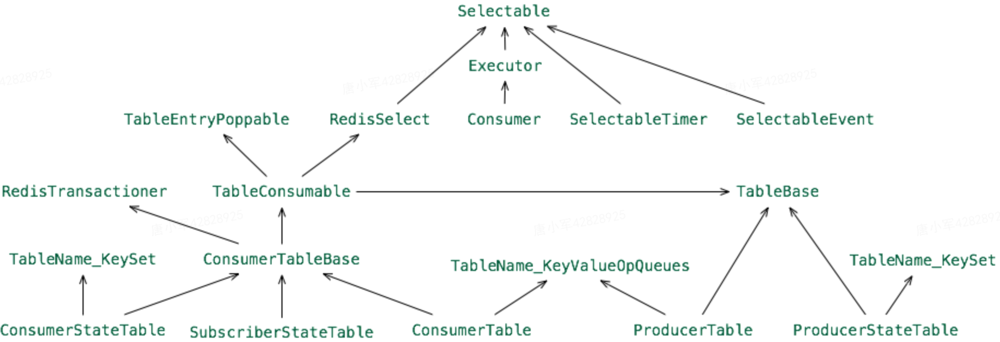
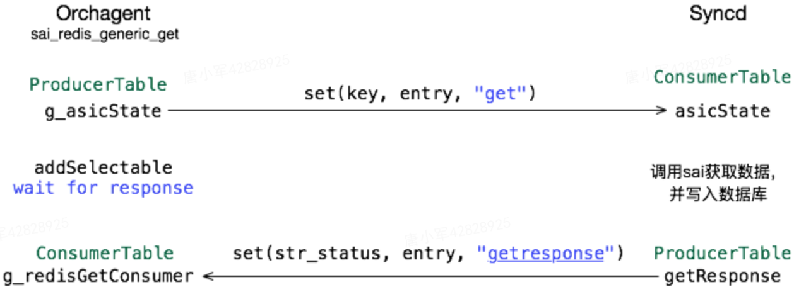

# sonic消息发布与订阅

## 概述

SONiC中服务间的通信基于Redis的发布/订阅实现，主要体现在sonic-swss-common中的生产者/消费者表。

简要的继承关系如图所示。其中生产者表有两种：ProducerTable和ProducerStateTable，相应的消费者为：ConsumerTable和ConsumerStateTable。

此外，消费者中还包括基于Redis键空间的SubscriberStateTable。由于消费者表皆继承了Selectable，因此可通过swss::Select进行事件监听(IO复用)。



下面主要介绍生产/消费表。


## ProducerTable与ConsumerTable

用于KeyOpFieldsValues类型数据的发布/订阅

**发布方数据格式**

```lua
/*
    * KEYS[1] : tableName + "_KEY_VALUE_OP_QUEUE
    * ARGV[1] : key
    * ARGV[2] : value
    * ARGV[3] : op
    * KEYS[2] : tableName + "_CHANNEL"
    * ARGV[4] : "G"
    */
string luaEnque =
    "redis.call('LPUSH', KEYS[1], ARGV[1], ARGV[2], ARGV[3]);"
    "redis.call('PUBLISH', KEYS[2], ARGV[4]);";
```

**订阅方处理过程**

通过Redis事务方式订阅消息，防止订阅前后的消息丢失

```c++
for (;;)
{
    RedisReply watch(m_db, string("WATCH ") + getKeyValueOpQueueTableName(), REDIS_REPLY_STATUS);
    watch.checkStatusOK();
    multi();
    enqueue(string("LLEN ") + getKeyValueOpQueueTableName(), REDIS_REPLY_INTEGER);
    subscribe(m_db, getChannelName());
    enqueue(string("LLEN ") + getKeyValueOpQueueTableName(), REDIS_REPLY_INTEGER);
    bool succ = exec();
    if (succ) break;
}
```

**消息处理**

- 数据处理在pops方法中实现，通过consumer_table_pops.lua脚本进行格式化和增删操作
- 格式化后的数据缓存于ConsumerTableBase的m_buffer
- 业务处理。如syncd中通过processEvent相关方法进行业务处理，最后通过libsai接口下发给ASIC

## ProducerStateTable与ConsumerStateTable

用于KeyFieldValues类型数据的发布/订阅

**发布方格式**

```lua
/*
* KEYS[1] : tableName + "_CHANNEL"
* KEYS[2] : tableName + "_KEY_SET"
* KEYS[3..] : "_" + tableName + tableSeparator + key
* ARGV[1] : "G"
* ARGV[2] : key
* ARGV[3] : Field
* ARGV[4] : Value
* ...
*/
string luaSet =
    "local added = redis.call('SADD', KEYS[2], ARGV[2])\n"
    "for i = 0, #KEYS - 3 do\n"
    "    redis.call('HSET', KEYS[3 + i], ARGV[3 + i * 2], ARGV[4 + i * 2])\n"
    "end\n"
    " if added > 0 then \n"
    "    redis.call('PUBLISH', KEYS[1], ARGV[1])\n"
    "end\n";
m_shaSet = m_pipe->loadRedisScript(luaSet);

/*
* KEYS[1] : tableName + "_CHANNEL"
* KEYS[2] : tableName + "_KEY_SET"
* KEYS[3] : "_" + tableName + tableSeparator + key
* KEYS[4] : tableName + "_DEL_SET"
* ARGV[1] : "G"
* ARGV[2] : key
* ARGV[3] : "''"
* ARGV[4] : "''"
*/
string luaDel =
    "local added = redis.call('SADD', KEYS[2], ARGV[2])\n"
    "redis.call('SADD', KEYS[4], ARGV[2])\n"
    "redis.call('DEL', KEYS[3])\n"
    "if added > 0 then \n"
    "    redis.call('PUBLISH', KEYS[1], ARGV[1])\n"
    "end\n";
m_shaDel = m_pipe->loadRedisScript(luaDel);

/*
* KEYS[1] : tableName + "_KEY_SET"
* KEYS[2] : "_" + tableName
* KEYS[3] : tableName + "_DEL_SET"
*/
string luaClear =
    "redis.call('DEL', KEYS[1])\n"
    "local keys = redis.call('KEYS', KEYS[2] .. '*')\n"
    "for i,k in pairs(keys) do\n"
    "    redis.call('DEL', k)\n"
    "end\n"
    "redis.call('DEL', KEYS[3])\n";
m_shaClear = m_pipe->loadRedisScript(luaClear);
```

**订阅方处理过程**

通过Redis事务方式订阅消息

```c++
for (;;)
{
    RedisReply watch(m_db, "WATCH " + getKeySetName(), REDIS_REPLY_STATUS);
    watch.checkStatusOK();
    multi();
    enqueue(std::string("SCARD ") + getKeySetName(), REDIS_REPLY_INTEGER);
    subscribe(m_db, getChannelName());
    bool succ = exec();
    if (succ) break;
}
```

**消息处理**

通过consumer_state_table_pops.lua脚本处理

```lua
/*
* KEYS[1] : tableName + "_KEY_SET"
* KEYS[2] : tableName + tableSeparator
* KEYS[3] : tableName + "_DEL_SET"
* ARGV[1] : POP_BATCH_SIZE
* ARGV[2] : "_"
*/
-- consumer_state_table_pops.lua
redis.replicate_commands()
local ret = {}
local tablename = KEYS[2]
local stateprefix = ARGV[2]
local keys = redis.call('SPOP', KEYS[1], ARGV[1])
local n = table.getn(keys)
for i = 1, n do
   local key = keys[i]
   -- Check if there was request to delete the key, clear it in table first
   local num = redis.call('SREM', KEYS[3], key)
   if num == 1 then
      redis.call('DEL', tablename..key)
   end
   -- Push the new set of field/value for this key in table
   local fieldvalues = redis.call('HGETALL', stateprefix..tablename..key)
   table.insert(ret, {key, fieldvalues})
   for i = 1, #fieldvalues, 2 do
      redis.call('HSET', tablename..key, fieldvalues[i], fieldvalues[i + 1])
   end
   -- Clean up the key in temporary state table
   redis.call('DEL', stateprefix..tablename..key)
end
return ret
```

> 不支持多消费者，支持多生产者

## SubscribeStateTable

基于Redis键空间方式，对整个表的键变化进行监听。

```c++
m_keyspace = "__keyspace@";
m_keyspace += to_string(db->getDbId()) + "__:" + tableName + m_table.getTableNameSeparator() + "*";
psubscribe(m_db, m_keyspace);
```

SubscribeStateTable的pops方法仅将del <key>转为DEL_COMMAND，其他都转为SET_COMMAND。以hash表为例，如果通过hset、hdel对field级数据进行操作，仍会转为SET_COMMAND，表示该key的数据已更新。

## 查询操作

发布/订阅是一种”单工“方式，对于查询操作这种”双工“方式，SONiC通过两个通道实现，以Orchagent与Syncd交互为例，主要过程如图。



备注: 除StateTable外其他待更新