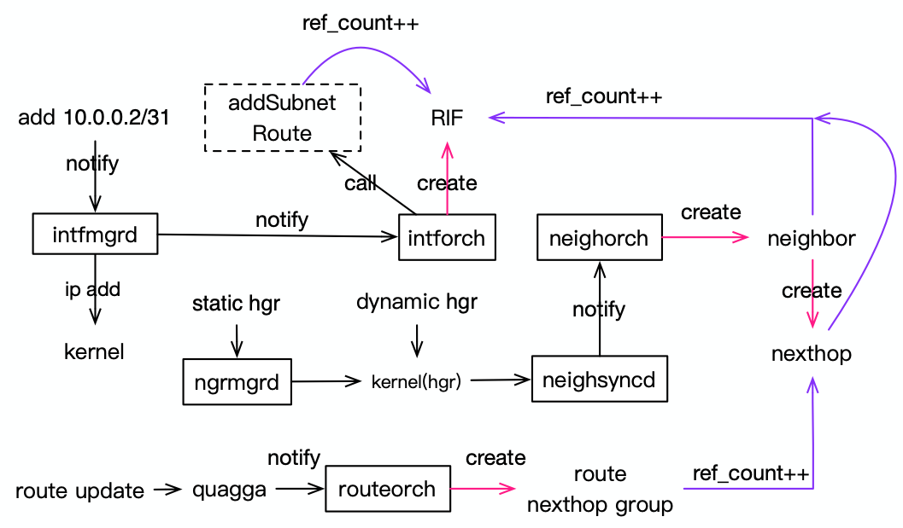

# 接口地址处理流程

  接口地址的增删，涉及到多个模块的联动以及资源的相互引用。下面以地址新增流程为例进行分析。
如下图所示，包含触发模块动作的事件和资源引用关系。
​

## 新增流程

- 接口上配置地址，db新增事件通知intfmgrd处理
  - 将地址通过ip addr添加到kernel
  - 将地址配置写入app db，通知intforch处理
- inforch处理
  - 如果该接口没有使能RIF，则通过sai创建rif实例
    - 使能RIF后，便可接收邻居及路由更新
  - 添加地址网段路由，且RIF ret_count++
- 新增静态邻居
  - 通过ngrmgrd服务直接向kernel发送netlink信息
- 动态邻居
  - neighsyncd服务，通过监听内核邻居信息，修改APP DB中的NEIGH_TABLE
- neighorch处理
  - 创建neighbor实例，新增接口RIF引用计数
  - 创建nexthop实例，新增接口RIF引用计数
- 路由更新处理
  - frr/quagga通过bgp学习到对端的路由后，更新APP DB的ROUTE_TABLE
  - routeorch创建route实例
    - 如果存在多个下一跳，创建nexthop group，并新增nexthop的引用

## 资源引用

RIF引用计数新增条件

- 添加接口自身子网路由
- 学习到新的邻居
  - 创建neighbor实例
  - 创建nexthop实例

nexthop引用计数新增条件

- 添加新路由实例
- 创建nexthop group实例
  - 如果该路由条目存在多个下一跳

注意事项

RIF的释放必须等待所有依赖资源删除完成

- 邻居的老化依赖内核配置
- 路由清除依赖bgp路由更新配置