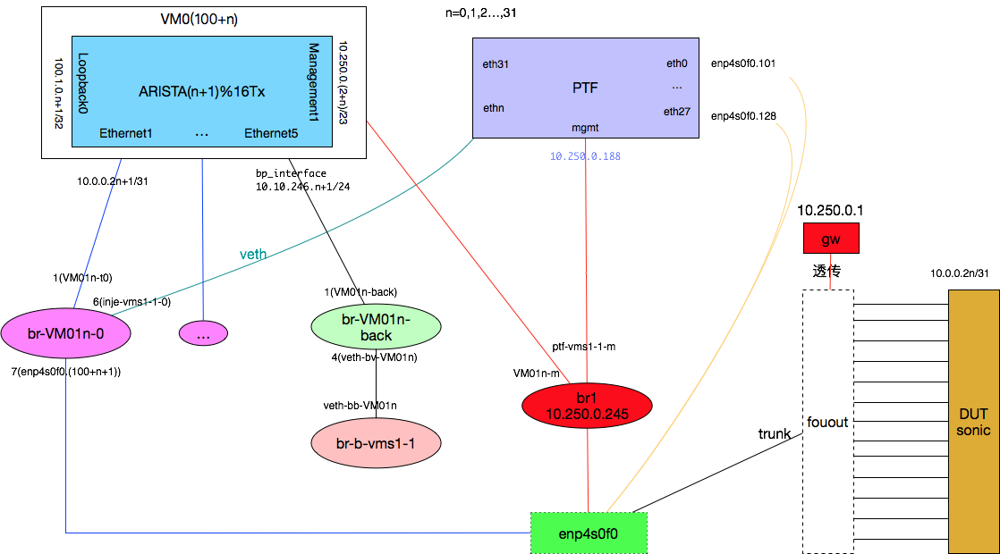

# SONiC测试环境网络
testbed server上的网络桥结构如图所示:


> VM和PTF使用10.250.0.0/24网段，有些测试case需要从PTF直接访问DUT机器，如果PTF与DUT不在同一个管理网段需配置两者的路由或在server上对br1网桥配置SNAT

- SNAT配置
  - 修改br1的地址为网关: 10.250.0.1
  - 配置10.250.0.0/24的SNAT。因docker会将FORWARD动作设置为DROP，所以需要对其放行
  ```
  iptables -t filter -A FORWARD -i br-txj -j ACCEPT
  iptables -t filter -A FORWARD -o br-txj -j ACCEPT
  iptables -t nat -A POSTROUTING -o enp2s0f0 -s 10.250.0.0/24 -j MASQUERADE
  ```
  - 可将enp4s0f0移出br1

> 默认情况fanout交换机会隔离二层，因此需要二层透传。

下边是华为交换机的透传配置
```
interface range 25GE 1/0/1 to 25GE 1/0/33
l2protocol-tunnel lldp lacp enable
commit
quit

l2protocol-tunnel lldp group-mac 0100-0001-0022
l2protocol-tunnel lacp group-mac 0100-0001-0033
commit
```

> 为实现tag数据包的透传，fanout交换机需要配置QinQ
```
port link-type dot1q-tunnel
```
